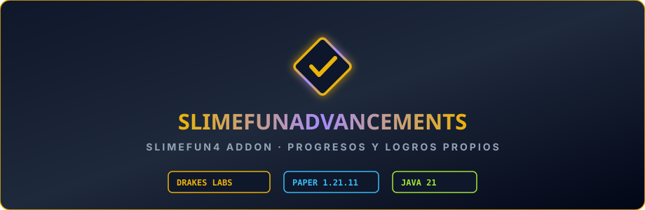

  

# SlimefunAdvancements

Addon de **Slimefun 4** que inyecta un árbol completo de **progresos y logros (Advancements)** nativos de Minecraft para guiar a los jugadores a través de la tecnología, magia y maquinaria de Slimefun. Portado y adaptado por **DrakesCraft Labs** para Paper/Purpur 1.21.11 en Java 21.

---

## 🎯 Objetivo

Ofrecer una experiencia de aprendizaje inmersiva e intuitiva donde los jugadores reciben notificaciones visuales, recompensas de experiencia y seguimiento de hitos al fabricar y dominar ítems de Slimefun.

---

## ⚡ Características Principales

- **Árbol de Progresos Nativo**:
  - Integrado directamente en la pestaña de Logros de Minecraft (`L`).
  - Hitos organizados por categorías: Básica, Electricidad, Armamento, Alquimia, Recursos y Endgame.
- **Inyección Segura en Hilo Principal**:
  - Lógica de sincronización con Paper 1.21.11 optimizada para evitar tirones de rendimiento (*tick lag*).
- **Traducción y Personalización**:
  - Nombres, descripciones y objetivos completamente traducidos al español.

---

## 🛠️ Entorno y Compatibilidad

- **Servidor**: Paper / Purpur 1.21.11
- **Java**: 21
- **Dependencias**:
  - `Slimefun4-Drake`

---

## 📜 Créditos y Origen

- **Autor original / Mantenimiento previo**: `SlimefunGuguProject`
- **Adaptación y Mantenimiento 1.21.11**: **DrakesCraft Labs**
